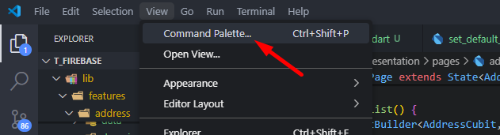
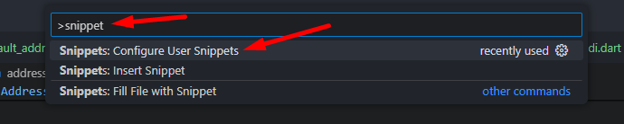
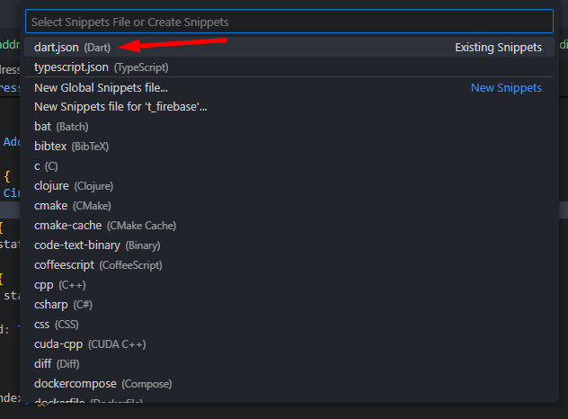
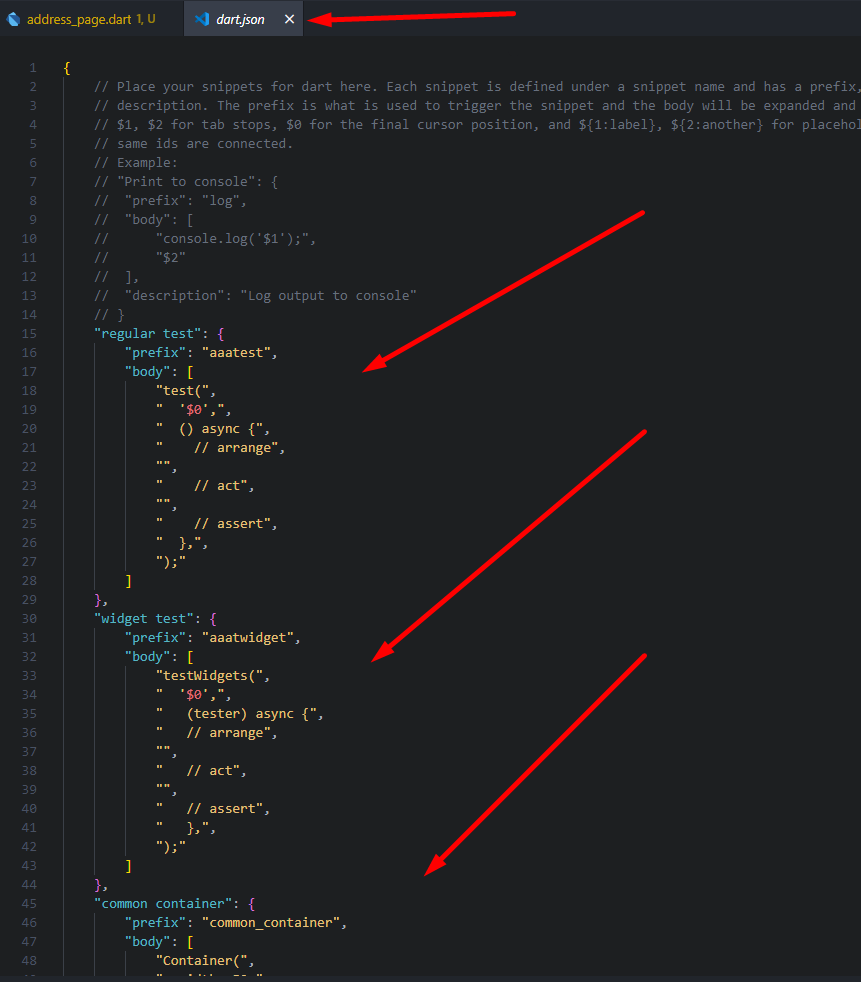
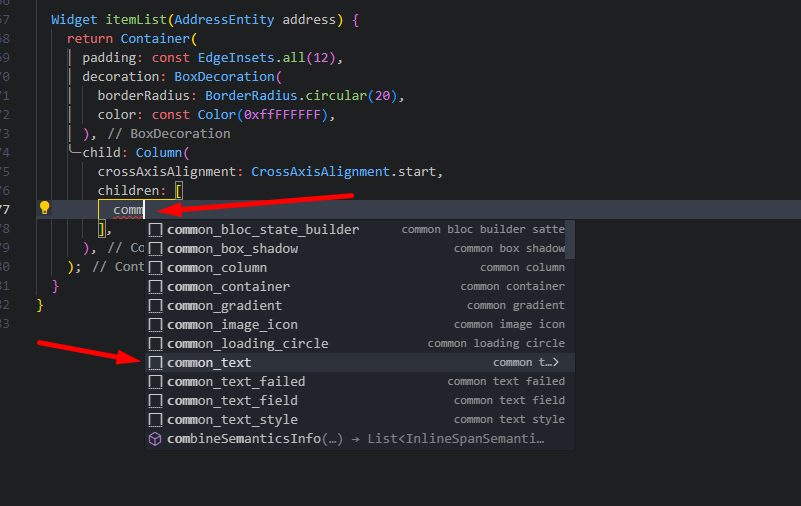
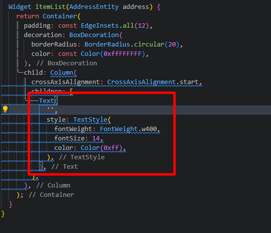

## Install

1. Open Comamnd Palette

   

2. Type Snippet

   

3. Choose Dart Language

   

4. Paste

   

## How to Use

1. Type prefix, for example `comm...`

   

2. Then Auto Generate

   
